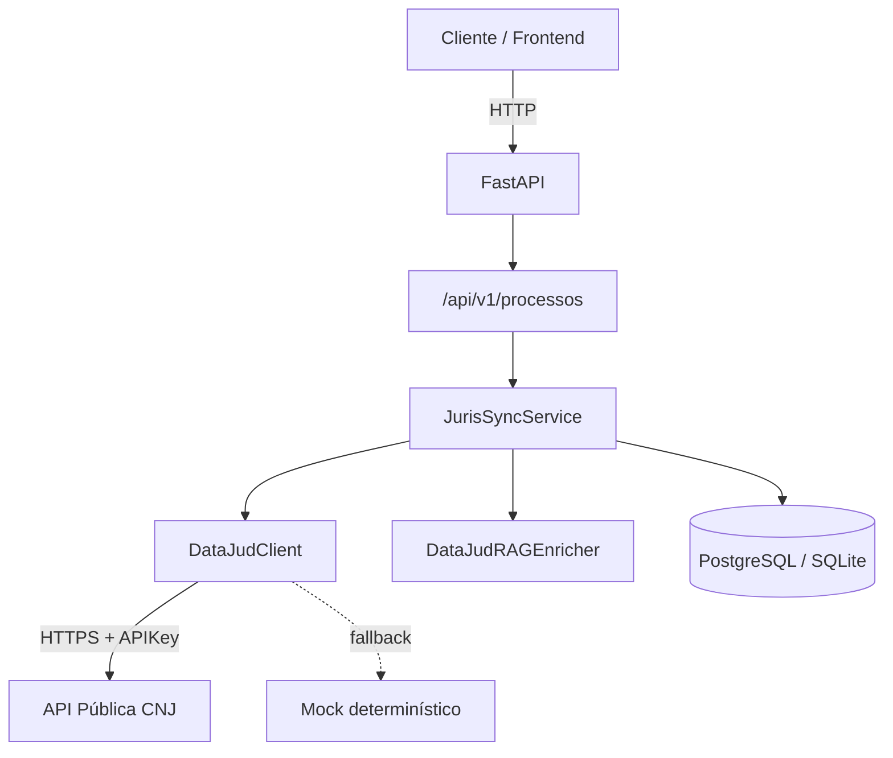
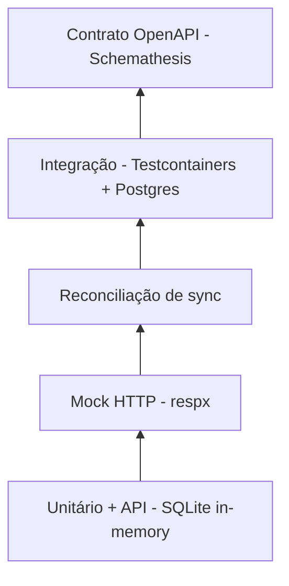

# Case study: JurisSync

> **Projeto âncora do portfólio** | [Site live](https://mariahilmar.vercel.app) | [API](https://github.com/MariaHilmar/juris-sync) | [Dashboard](https://github.com/MariaHilmar/juris-sync-web) | [Guia do testador](https://github.com/MariaHilmar/juris-sync-web/blob/main/docs/guia-do-testador.md)

**Escopo:** artefatos exclusivos de portfólio para demonstração e avaliação local (clone + run). Não são serviços em produção. Sem autenticação de usuários finais.

---

## 1. Contexto e problema

### Cenário

Escritórios jurídicos, departamentos de compliance e equipes de jurimetria precisam acompanhar processos judiciais brasileiros. A [API Pública do DataJud (CNJ)](https://datajud-wiki.cnj.jus.br/api-publica/) centraliza dados processuais, mas consumi-la de forma confiável exige:

- Integração com múltiplos tribunais e formatos heterogêneos
- Normalização de campos (classe, assunto, tribunal)
- Persistência local para consultas e análises sem repetir chamadas externas
- Garantia de que re-sincronizações não dupliquem dados

### Problema de negócio

Consultar processos tribunal a tribunal é lento, fragmentado e difícil de auditar. Sem um pipeline controlado, equipes perdem tempo repetindo consultas, acumulam inconsistências e não conseguem agregar dados para análise (jurimetria).

### Objetivo do produto

Construir uma API que:

1. Sincronize processos pelo número CNJ a partir do DataJud (ou mock para desenvolvimento)
2. Mantenha histórico local de movimentações sem duplicidade
3. Exponha consultas e estatísticas agregadas (jurimetria)
4. Seja entregue com qualidade mensurável: testes em camadas, CI e documentação rastreável

---

## 2. Papel e abordagem

### Papel

Atuação como **Product Owner com base técnica**: definição do escopo, priorização em sprints, documentação de requisitos em paralelo ao código e decisões de arquitetura alinhadas a entregas testáveis.

### Abordagem

| Princípio | Como aparece no projeto |
|-----------|-------------------------|
| Entrega incremental | 5 sprints com entregas verificáveis |
| Documentação viva | Requisitos, regras de negócio e BDD escritos junto com o código |
| Qualidade como requisito | Cobertura mínima de 85% no CI; testes guiam refatorações |
| Desenvolvimento sem bloqueio | Mock determinístico do DataJud quando não há chave de API |
| Observabilidade | Logs estruturados (structlog) e health check com status do banco e modo DataJud |

### Fora de escopo (decisão consciente)

- Autenticação de usuários finais (JWT preparado na config, sem endpoints de login)
- Notificações de mudança de andamento
- Edição manual de processos
- Deploy público da API como serviço contínuo (a avaliação esperada é local)

### Fontes de dados (mock vs real)

| Modo | Quando | Como identificar |
|------|--------|------------------|
| **Mock (padrão)** | Sem `DATAJUD_API_KEY` | `/health` → `mock_mode`; badge "Mock (demo)" no dashboard |
| **Real (DataJud)** | Com chave CNJ do testador | `/health` → `configured`; use CNJs reais |

Quem avalia o portfólio pode clonar os repos, usar o mock ou configurar a própria chave. Passo a passo: [Guia do testador](https://github.com/MariaHilmar/juris-sync-web/blob/main/docs/guia-do-testador.md).

---

## 3. Solução

### Visão geral

O **JurisSync** é um produto técnico de portfólio em duas partes:

1. **API** REST assíncrona (FastAPI) - pipeline de sincronização idempotente entre a API do DataJud (ou mock) e um banco relacional local (SQLite em desenvolvimento; PostgreSQL opcional via Compose)
2. **Dashboard** ([juris-sync-web](https://github.com/MariaHilmar/juris-sync-web)) - Next.js + React + TypeScript consumindo a API (jurimetria, lista, detalhe, sync)

A [vitrine Astro](https://mariahilmar.vercel.app) (`maria-portfolio`) apresenta o case study; o dashboard Next é a evidência de frontend de mercado, rodando localmente junto com a API.

### Componentes principais

| Componente | Responsabilidade |
|------------|------------------|
| `DataJudClient` | Consulta a API CNJ ou gera mock determinístico a partir do número CNJ |
| `DataJudRAGEnricher` | Normaliza classe, assunto e tribunal com base em conhecimento jurídico em memória |
| `JurisSyncService` | Orquestra extração, enriquecimento, validação e persistência |
| API `/api/v1/processos` | Sync, listagem, detalhe e endpoints de jurimetria |
| Alembic | Versionamento de schema (`processos`, `movimentacoes`) |
| `juris-sync-web` | UI Next.js: dashboard, processos, timeline |

### Pipeline ETL (sincronização)

```
Extração (DataJud/mock)
    → Enriquecimento (RAG)
    → Validação (Pydantic v2)
    → Persistência idempotente (upsert + movimentações novas)
```

### Endpoints de negócio

| Método | Rota | Valor |
|--------|------|-------|
| `POST` | `/api/v1/processos/sync` | Sincroniza processo pelo CNJ |
| `GET` | `/api/v1/processos/` | Lista com paginação e filtros |
| `GET` | `/api/v1/processos/{id}` | Detalhe com movimentações |
| `GET` | `/api/v1/processos/stats/por-tribunal` | Jurimetria por tribunal |
| `GET` | `/api/v1/processos/stats/por-assunto` | Jurimetria por assunto |
| `GET` | `/health` | Status da API, banco e modo DataJud |

### Jurimetria (análise)

Os endpoints de stats executam agregações SQL (`GROUP BY`) sobre os processos persistidos, permitindo visão de distribuição por tribunal e assunto sem nova consulta ao DataJud.

---

## 4. Arquitetura



### Modelo de dados

| Tabela | Campos principais |
|--------|-------------------|
| `processos` | `numero_cnj` (único), `tribunal`, `classe`, `assunto`, `grau` |
| `movimentacoes` | `processo_id` (FK), `data_hora`, `descricao`, `codigo_movimento` |

Relacionamento 1:N com cascata: um processo possui várias movimentações.

---

## 5. Decisões técnicas e trade-offs

| Decisão | Motivo | Trade-off |
|---------|--------|-----------|
| **FastAPI + SQLAlchemy async** | I/O não bloqueante em chamadas externas e banco | Curva de aprendizado maior que sync |
| **Idempotência incremental** | Re-sync não duplica processos nem movimentações | Lógica de reconciliação mais complexa |
| **Mock determinístico do DataJud** | Desenvolvimento e CI sem depender de chave CNJ | Dados mock não refletem tribunal real |
| **RAG em memória (TF-IDF simplificado)** | Normaliza campos sem custo de infraestrutura | Não escala para grandes bases; sem FAISS/embeddings pesados |
| **SQLite (dev) + PostgreSQL (prod)** | Feedback rápido local; Postgres real nos testes de integração | Dois comportamentos de banco para validar |
| **Pydantic v2 na fronteira** | Validação explícita de CNJ e tipos na API | Schemas duplicam parte do modelo ORM |
| **Documentação de requisitos separada** | Rastreabilidade requisito → código → teste | Manutenção de dois artefatos (README + requisitos.md) |

### Regras de negócio críticas

- **RN01:** Um processo por número CNJ (constraint `UNIQUE`)
- **RN02:** Sync é upsert (cria ou atualiza campos do processo)
- **RN03:** Movimentações inseridas apenas se a combinação `(data_hora, descricao)` for nova
- **RN04:** Falha parcial na persistência faz rollback completo (atomicidade)

Detalhes em [`juris-sync/docs/requisitos.md`](../../juris-sync/docs/requisitos.md).

---

## 6. Gestão da entrega

### Roadmap em sprints

| Sprint | Entrega | O que liberou |
|--------|---------|---------------|
| 1 | Setup e boilerplate | Estrutura FastAPI, config, logging, health check |
| 2 | Banco + Alembic | Modelo relacional, migrations, persistência async |
| 3 | Motor DataJud | Cliente HTTP, mock, integração real, pipeline de sync |
| 4 | Testes Pytest | Suíte em camadas, cobertura ≥ 85%, reconciliação |
| 5 | README + CI/CD | Pipeline GitHub Actions, documentação técnica |

### Critérios de aceite transversais

- Todo endpoint documentado no OpenAPI (`/docs`)
- Requisitos rastreáveis até testes automatizados
- CI verde em lint, testes unitários/API e integração/contrato
- Desenvolvimento possível sem credenciais externas (modo mock)

### Artefatos de gestão

| Artefato | Local |
|----------|-------|
| Roadmap de sprints | [`juris-sync/README.md`](../../juris-sync/README.md#roadmap-sprints) |
| Requisitos e BDD | [`juris-sync/docs/requisitos.md`](../../juris-sync/docs/requisitos.md) |
| Rastreabilidade | Seção 9 de requisitos.md (requisito → código → teste) |
| Coleção Postman (demo manual) | [`juris-sync/postman/`](../../juris-sync/postman/) |

---

## 7. Qualidade

### Pirâmide de testes (5 camadas)



| Camada | O que valida | Ferramentas |
|--------|--------------|-------------|
| Unitário/API | Regras de negócio, schemas, endpoints | pytest, httpx ASGI |
| Mock HTTP | Contrato da chamada DataJud, fallbacks | respx |
| Reconciliação | Fidelidade dos dados, atomicidade, sem órfãos | pytest + SQLite |
| Integração | Postgres real, migrations Alembic | Testcontainers |
| Contrato | Fuzzing do schema OpenAPI | Schemathesis, Hypothesis |

### Números

| Métrica | Valor |
|---------|-------|
| Testes automatizados | 43 |
| Cobertura (suíte padrão) | ~89,9% |
| Portão de qualidade | Falha CI se cobertura < 85% |
| Jobs de CI | 3 (Lint, Test, Integration & Contract) |

### Evidências visuais

| Evidência | Referência |
|-----------|------------|
| CI | [](https://github.com/MariaHilmar/juris-sync/actions/workflows/ci.yml) |
| Cobertura |  |
| Swagger UI | Ver instruções em [`docs/assets/README.md`](assets/README.md) |

### CI/CD (GitHub Actions)

| Job | Etapas |
|-----|--------|
| **Lint** | `ruff check` + `black --check` + `mypy` |
| **Test** | `pytest` com cobertura (suíte padrão) |
| **Integration** | Testcontainers (Postgres) + Schemathesis (contrato) |

Workflow: [`.github/workflows/ci.yml`](https://github.com/MariaHilmar/juris-sync/blob/main/.github/workflows/ci.yml)

---

## 8. Resultados e aprendizados

### Resultados

- API funcional com sync idempotente, consultas e jurimetria básica
- Documentação de requisitos com histórias de usuário, BDD e rastreabilidade
- Suíte de testes que cobre desde unidade até contrato OpenAPI
- Pipeline de CI que bloqueia regressões de qualidade
- Desenvolvimento desbloqueado via mock determinístico (sem dependência de chave CNJ)

### Evidências citáveis (sem abrir código)

1. **"43 testes em 5 camadas, incluindo Postgres real via Testcontainers e fuzzing OpenAPI com Schemathesis"**
2. **"Pipeline ETL idempotente com reconciliação: re-sync não duplica processos nem movimentações"**

### Aprendizados

| Aprendizado | Próximo passo possível |
|-------------|------------------------|
| Mock determinístico acelera muito o ciclo de desenvolvimento | Manter para demos públicas sem chave CNJ |
| RAG em memória resolve normalização simples, mas não escala | Evoluir para embeddings + vector store se o domínio crescer |
| Documentação viva exige disciplina, mas paga na rastreabilidade | Replicar o modelo em novos projetos do portfólio |
| Jurimetria via SQL é suficiente para MVP | Dashboard Next.js (`juris-sync-web`) + ilustração no [site](https://mariahilmar.vercel.app/#jurimetria) |

---

## 9. Links

| Recurso | URL |
|---------|-----|
| Site do portfólio (vitrine Astro) | https://mariahilmar.vercel.app |
| Hub `maria-portfolio` | https://github.com/MariaHilmar/maria-portfolio |
| API `juris-sync` | https://github.com/MariaHilmar/juris-sync |
| Dashboard `juris-sync-web` | https://github.com/MariaHilmar/juris-sync-web |
| Guia do testador (mock vs real) | https://github.com/MariaHilmar/juris-sync-web/blob/main/docs/guia-do-testador.md |
| Documentação de requisitos | [`juris-sync/docs/requisitos.md`](../../juris-sync/docs/requisitos.md) |
| Swagger UI (local) | http://localhost:8000/docs |
| Workflow CI (API) | https://github.com/MariaHilmar/juris-sync/actions/workflows/ci.yml |
| API DataJud (CNJ) | https://datajud-wiki.cnj.jus.br/api-publica/ |

### Como rodar localmente (resumo)

Avaliação esperada: **clone + ambiente local**. Passo a passo completo (API + dashboard, mock ou real): [Guia do testador](https://github.com/MariaHilmar/juris-sync-web/blob/main/docs/guia-do-testador.md).

```powershell
# API
cd juris-sync
python -m venv .venv
.\.venv\Scripts\Activate.ps1
pip install -r requirements-dev.txt
copy .env.example .env
python -m alembic upgrade head
python -m uvicorn app.main:app --host 0.0.0.0 --port 8000 --reload
# opcional (mock rico): python scripts/seed_demo.py

# Dashboard (outro terminal)
cd juris-sync-web
copy .env.example .env.local
npm install
npm run dev
```

- API: http://localhost:8000/docs  
- Dashboard: http://localhost:3000  

---

*Case study elaborado como parte do hub de portfólio em `maria-portfolio`.*
