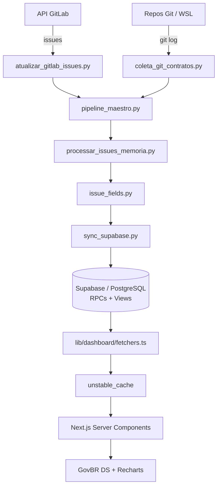

# Case study: MGI KPI

> **Projeto de portfólio BI de engenharia** | [Site live](https://mariahilmar.vercel.app) | [Dashboard](https://github.com/MariaHilmar/mgi-kpi-dashboard) | [Pipeline](https://github.com/MariaHilmar/mgi-kpi-pipeline) | [Demo](https://web-mgi-delog.vercel.app)

**Escopo:** artefatos de portfólio para demonstração e avaliação local (clone + run). Não é sistema oficial do MGI nem produto institucional. Sem dados reais, tokens ou credenciais versionados.

---

## 1. Contexto e problema

### Cenário

Times de engenharia que monitoram entregas via GitLab acumulam dados em planilhas manuais: issues, commits, sprints, SLA e qualidade de preenchimento ficam fragmentados. Sem um pipeline confiável e um dashboard somente leitura, gestores perdem tempo consolidando Excel, repetem cálculos e não conseguem auditar KPIs de forma consistente.

### Problema de negócio

- Métricas de throughput, lead time e backlog dependem de regras de negócio complexas (taxonomia, área funcional, SLA)
- Dados de issues e Git precisam ser reconciliados sem duplicidade
- O dashboard deve ser estável, performático e acessível (GovBR Design System)
- Avaliadores técnicos precisam clonar, rodar localmente e validar qualidade (testes, CI, SonarCloud)

### Objetivo do produto

Construir um ecossistema em duas partes:

1. **Pipeline Python** - ETL que extrai issues (GitLab API) e commits (`git log`), aplica regras em memória e sincroniza com Supabase via upsert idempotente
2. **Dashboard Next.js** - visualização analítica somente leitura, com RPCs PostgreSQL, cache e autenticação integrada

---

## 2. Papel e abordagem

### Papel

**Product Owner com base técnica**: definição do escopo de KPIs, contrato de dados entre pipeline e dashboard, priorização incremental e governança de qualidade (testes, CI, análise estática).

### Abordagem

| Princípio | Como aparece no projeto |
|-----------|-------------------------|
| Contrato via banco | Pipeline escreve; dashboard lê. Sem acoplamento direto entre repos |
| Lógica pura e testável | Regras de taxonomia, SLA e qualidade em funções Python isoladas |
| Agregações no Postgres | RPCs centralizam KPIs; frontend foca em visualização |
| Idempotência | Upsert em issues, releases e participantes; reprocessar é seguro |
| Operação local | Scripts Python + Task Scheduler (Windows); sem servidor dedicado de ETL |
| Qualidade mensurável | 174 testes (pipeline) + 358 testes (dashboard); SonarCloud no frontend |

### Fora de escopo (decisão consciente)

- Alteração de issues no GitLab a partir do dashboard (somente leitura na origem)
- Dados reais ou credenciais no repositório público
- Processamento distribuído em escala de milhões de registros (evolução futura: streaming ou views SQL materializadas)

---

## 3. Solução

### Visão geral

O **MGI KPI** é um produto técnico de portfólio em duas partes:

1. **[mgi-kpi-pipeline](https://github.com/MariaHilmar/mgi-kpi-pipeline)** - orquestração ETL, transformação em memória e carga no Supabase
2. **[mgi-kpi-dashboard](https://github.com/MariaHilmar/mgi-kpi-dashboard)** - Next.js 16 + GovBR DS, Server Components, cache `unstable_cache` (TTL 24 h) e filtros globais via URL

A [vitrine Astro](https://mariahilmar.vercel.app) apresenta o case study; o dashboard na Vercel é a evidência de produto web com autenticação.

### Componentes principais (pipeline)

| Módulo | Responsabilidade |
|--------|------------------|
| `atualizar_gitlab_issues.py` | Extração de issues via API GitLab |
| `coleta_git_contratos.py` | Commits, branches e releases via `git log` (WSL) |
| `pipeline_maestro.py` | Orquestrador central (entry point) |
| `processar_issues_memoria.py` | Transforma issues cruas em records Supabase |
| `issue_fields.py` | Core de regras: datas, lead time, idade, SLA, qualidade |
| `taxonomy.py` / `detectar_area_funcional.py` | Classificação e inferência de área/tipo |
| `sync_supabase.py` | Upsert idempotente (issues, releases, participantes, sync_runs) |

### Componentes principais (dashboard)

| Camada | Responsabilidade |
|--------|------------------|
| `lib/dashboard/fetchers.ts` | Consultas tipadas ao Supabase |
| `unstable_cache` | Cache de agregações com TTL de 24 h |
| RPCs PostgreSQL | KPIs executivos, fluxo Kanban, throughput, lead time |
| `app/(dashboard)/` | Páginas analíticas, operacionais e de gestão |
| Supabase Auth | Login, papéis `admin` / `user`, área administrativa |

### Pipeline ETL

```
Extração (GitLab API + git log)
    → Transformação em memória (taxonomia, SLA, qualidade, Dev/Git)
    → Carga idempotente (upsert Supabase)
    → Consumo read-only (dashboard via RPCs)
```

### Páginas do dashboard (resumo)

| Grupo | Rotas | Valor |
|-------|-------|-------|
| Analítico | `/`, `/temporal`, `/fluxo`, `/detalhamento`, `/qualidade`, `/alertas` | KPIs executivos, CFD, lead time, conformidade |
| Operacional | `/sprint`, `/parcerias`, `/equipes`, `/analistas`, `/issues` | Visões por sprint, equipe e busca paginada |
| Gestão | `/importar-dados`, `/admin/usuarios`, `/conta` | Planning Poker, CRUD de usuários, perfil |

---

## 4. Arquitetura



### Contrato de dados

O pipeline e o dashboard **não se comunicam diretamente**. O contrato é o schema versionado em `supabase/migrations`:

- **Escrita (pipeline):** `issues`, `gitlab_users`, `issue_participants`, `releases`, `sync_runs`
- **Leitura (dashboard):** views (`v_kpis`, `v_filter_options`) e RPCs (`dashboard_aggregate`, entre outras)

Detalhes: [docs/03-integracao-dashboard.md](https://github.com/MariaHilmar/mgi-kpi-pipeline/blob/main/docs/03-integracao-dashboard.md).

---

## 5. Decisões técnicas e trade-offs

| Decisão | Motivo | Trade-off |
|---------|--------|-----------|
| **Processamento em memória (Python)** | Regras testáveis sem I/O; escala adequada ao portfólio | Não escala para volumes massivos sem evolução |
| **RPCs no PostgreSQL** | Agregações estáveis; dashboard somente leitura | Lógica dividida entre Python e SQL |
| **Upsert idempotente** | Re-sync seguro; preserva campos manuais no Supabase | Lógica de merge mais complexa |
| **Server Components + cache 24 h** | Navegação fluida entre páginas analíticas | Dados podem ficar defasados até revalidação |
| **GovBR Design System** | Acessibilidade e identidade visual governamental | Curva de adaptação de componentes |
| **Extração Git via WSL** | `git log` em repos Windows montados no WSL | Dependência de ambiente local para coleta Git |

### Regras de negócio críticas

- **Taxonomia e área funcional** inferidas por título, labels e padrões configuráveis
- **SLA e faixa de idade** calculados a partir de datas de criação/fechamento
- **Qualidade de preenchimento** validada por flags (`modulo_ok`, `area_ok`, `padrao_completo`)
- **Campos manuais** no Supabase preservados no upsert (não sobrescritos pelo sync)

---

## 6. Qualidade

### Pipeline (Python)

| Métrica | Valor |
|---------|-------|
| Testes automatizados | 174 |
| Cobertura mínima (CI) | 38% |
| Ferramentas | pytest, pytest-cov, Ruff |
| CI | GitHub Actions (Python 3.11/3.12) |

Camadas de teste: funções puras (`issue_fields`, taxonomia), construção de records, filtros, sync Supabase (HTTP mockado).

### Dashboard (Next.js)

| Métrica | Valor |
|---------|-------|
| Testes automatizados | 358 |
| Ferramentas | Vitest, Testing Library, ESLint, TypeScript |
| Qualidade contínua | SonarCloud |
| CI | GitHub Actions (lint, tsc, testes, cobertura) |

### Evidências citáveis

1. **"Upsert idempotente com RPCs nativos PostgreSQL - pipeline e dashboard desacoplados por contrato de schema"**
2. **"358 testes no frontend + 174 no pipeline - governança de qualidade ponta a ponta"**
3. **"Demo live autenticada com GovBR DS e drill-down de KPIs para listagem de issues"**

### CI/CD

| Repositório | Workflow |
|-------------|----------|
| Pipeline | [](https://github.com/MariaHilmar/mgi-kpi-pipeline/actions/workflows/tests.yml) |
| Dashboard | [](https://github.com/MariaHilmar/mgi-kpi-dashboard/actions/workflows/ci.yml) |

---

## 7. Resultados e aprendizados

### Resultados

- Substituição de planilhas manuais por pipeline ETL automatizado e dashboard analítico
- Contrato de dados versionado entre pipeline e frontend (migrations Supabase)
- Interface funcional com autenticação, filtros globais e exportação
- Suítes de teste que cobrem regras de negócio puras e componentes React
- Deploy do dashboard na Vercel com demo pública autenticada

### Aprendizados

| Aprendizado | Próximo passo possível |
|-------------|------------------------|
| RPCs no banco evitam duplicar agregações no frontend | Materializar views para KPIs mais pesados |
| Funções puras no pipeline aceleram testes e refatoração | Extrair pacote compartilhado de taxonomia |
| Cache de 24 h melhora UX em dashboards analíticos | Revalidação sob demanda via webhook do pipeline |
| SonarCloud complementa testes unitários no frontend | Expandir gates de qualidade no pipeline |

---

## 8. Links

| Recurso | URL |
|---------|-----|
| Site do portfólio | https://mariahilmar.vercel.app |
| Hub `maria-portfolio` | https://github.com/MariaHilmar/maria-portfolio |
| Dashboard `mgi-kpi-dashboard` | https://github.com/MariaHilmar/mgi-kpi-dashboard |
| Pipeline `mgi-kpi-pipeline` | https://github.com/MariaHilmar/mgi-kpi-pipeline |
| Demo live (autenticada) | https://web-mgi-delog.vercel.app |
| Integração pipeline ↔ dashboard | https://github.com/MariaHilmar/mgi-kpi-pipeline/blob/main/docs/03-integracao-dashboard.md |
| Documentação do dashboard | https://github.com/MariaHilmar/mgi-kpi-dashboard/blob/main/docs/README.md |
| Workflow CI (pipeline) | https://github.com/MariaHilmar/mgi-kpi-pipeline/actions/workflows/tests.yml |
| Workflow CI (dashboard) | https://github.com/MariaHilmar/mgi-kpi-dashboard/actions/workflows/ci.yml |

### Como rodar localmente (resumo)

Avaliação esperada: **clone + ambiente local**. Configure `.env` / `.env.local` com credenciais próprias (GitLab + Supabase). Nenhum token vem no repositório.

```powershell
# Pipeline
git clone https://github.com/MariaHilmar/mgi-kpi-pipeline.git
cd mgi-kpi-pipeline
python -m venv .venv
.\.venv\Scripts\Activate.ps1
pip install -r requirements-dev.txt
copy .env.example .env
python pipeline_maestro.py --help

# Dashboard (outro terminal)
git clone https://github.com/MariaHilmar/mgi-kpi-dashboard.git
cd mgi-kpi-dashboard
npm install
copy .env.local.example .env.local
npm run dev
# http://localhost:3000
```

- Aplique as migrations em `supabase/migrations/` no seu projeto Supabase antes do sync
- Para desenvolvimento sem login: `NEXT_PUBLIC_AUTH_REQUIRED=false` no `.env.local`

---

*Case study elaborado como parte do hub de portfólio em `maria-portfolio`. Complementa os eixos jurídico (JurisSync) e fintech (PayCore) com evidência em BI de engenharia e ETL.*
