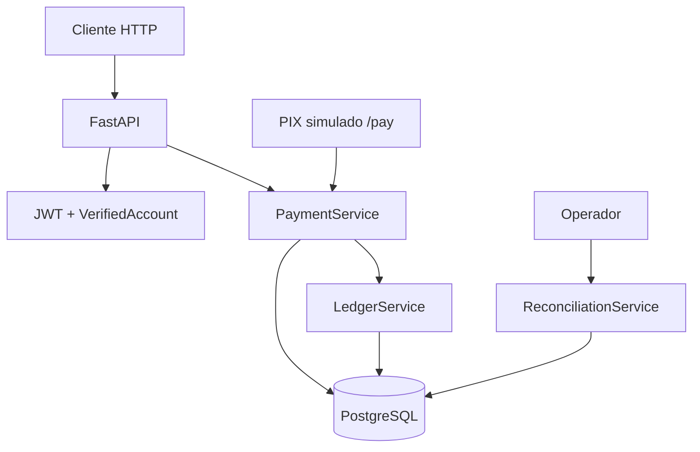

# Case study: PayCore

> **Projeto de portfólio fintech** | [Site live](https://mariahilmar.vercel.app) | [Repositório](https://github.com/MariaHilmar/paycore) | [Segurança e limitações](https://github.com/MariaHilmar/paycore/blob/main/docs/SEGURANCA.md)

**Escopo:** artefato educacional para demonstração e avaliação local (`docker compose up`). Não é PSP homologado nem instituição de pagamento. Sem deploy público da API como serviço contínuo.

---

## 1. Contexto e problema

### Cenário

Sistemas financeiros que armazenam saldo como coluna mutável (`accounts.balance`) estão expostos a corrupção silenciosa: um bug, uma race condition ou um rollback parcial pode desalinhar o número do histórico real, **sem trilha de auditoria**.

### Problema de negócio

Em fintechs, recrutadores e times de engenharia esperam ver:

- Ledger de partidas dobradas (dinheiro só se move, nunca se cria)
- Idempotência em operações financeiras (retries seguros)
- Tratamento de concorrência (sem overdraft)
- Consciência de segurança (mesmo em MVP)

### Objetivo do produto

Construir uma carteira digital mínima que:

1. Registre depósitos e saques via PIX **simulado**
2. Permita transferências P2P entre contas
3. Derive saldo exclusivamente do ledger (`ledger_entries`)
4. Prove integridade contábil via endpoint de conciliação
5. Seja entregue com documentação SDD rastreável e testes de invariantes críticos

---

## 2. Papel e abordagem

### Papel

**Product Owner com base técnica**: escopo em camadas (Lite → completo), requisitos e BDD em paralelo ao código, decisões de arquitetura documentadas em ADRs.

### Abordagem

| Princípio | Como aparece no projeto |
|-----------|-------------------------|
| Correção financeira primeiro | Ledger double-entry antes de features de vitrine |
| Banco como última defesa | `UNIQUE`, `CHECK`, `SELECT FOR UPDATE` |
| Extensibilidade | Enums + JSONB; saque e conciliação entraram sem reescrever o núcleo |
| Segurança documentada | Limitações conscientes em [`SEGURANCA.md`](https://github.com/MariaHilmar/paycore/blob/main/docs/SEGURANCA.md) |
| Metodologia SDD | IA generativa para acelerar boilerplate e docs; revisão humana + testes para invariantes |

### Fora de escopo (decisão consciente)

- Integração real com rede PIX / BACEN
- KYC com upload de documento (flag `is_verified` + `/dev/verify-me` para demo)
- Antifraude, rate limiting, webhooks assíncronos (roadmap)
- Deploy público sem hardening mínimo

Detalhes de threat model: [`paycore/docs/SEGURANCA.md`](https://github.com/MariaHilmar/paycore/blob/main/docs/SEGURANCA.md).

---

## 3. Solução

### Visão geral

O **PayCore Lite** é uma API REST (FastAPI) com PostgreSQL que implementa:

1. **Auth** - cadastro, login JWT, gate KYC
2. **Ledger** - partidas dobradas com conta de settlement (`0000000000`)
3. **PIX mock** - depósito em duas fases (`PENDING` → `/pay` → `COMPLETED`)
4. **Saque PIX** - espelho do depósito com validação de saldo
5. **Transferência P2P** - débito/crédito atômicos com idempotência
6. **Conciliação** - prova soma-zero global e balanço por transação

### Componentes principais

| Componente | Responsabilidade |
|------------|------------------|
| `LedgerService` | Saldo derivado, `post_double_entry`, extrato |
| `PaymentService` | Depósito, saque, transferência, idempotência |
| `AuthService` | Registro, autenticação, verificação KYC (demo) |
| `ReconciliationService` | Cruzamento ledger × transações |
| Conta de settlement | Contrapartida de dinheiro que entra/sai via PIX |

### Fluxo contábil (transferência P2P)

```
Alice transfere R$ 50 para Bob:

  transaction_id: abc-123
  ├── DEBIT   Alice  5000 centavos
  └── CREDIT  Bob    5000 centavos

Saldo(Alice) = Σ créditos − Σ débitos
```

### Endpoints principais

| Método | Rota | Descrição |
|--------|------|-----------|
| `POST` | `/api/v1/auth/register` | Cadastro + conta |
| `POST` | `/api/v1/pix/deposit` | Cria cobrança PIX (`PENDING`) |
| `POST` | `/api/v1/pix/deposit/{txid}/pay` | Simula liquidação (webhook mock) |
| `POST` | `/api/v1/pix/withdraw` | Saque PIX |
| `POST` | `/api/v1/transfers` | P2P por número de conta |
| `GET` | `/api/v1/admin/reconciliation` | Relatório de integridade (`X-Admin-Key`) |

Todo `POST` financeiro exige header `Idempotency-Key`.

---

## 4. Arquitetura



Camadas: rotas → services → modelos ORM. Services não conhecem HTTP.

Documentação completa:

| Documento | Conteúdo |
|-----------|----------|
| [`requisitos.md`](https://github.com/MariaHilmar/paycore/blob/main/docs/requisitos.md) | RN01-RN17, BDD, rastreabilidade |
| [`ARQUITETURA.md`](https://github.com/MariaHilmar/paycore/blob/main/docs/ARQUITETURA.md) | ADRs, concorrência, idempotência |
| [`arquitetura-c4.md`](https://github.com/MariaHilmar/paycore/blob/main/docs/arquitetura-c4.md) | Modelo C4 |
| [`modelo-dados.md`](https://github.com/MariaHilmar/paycore/blob/main/docs/modelo-dados.md) | Dicionário de dados |
| [`SEGURANCA.md`](https://github.com/MariaHilmar/paycore/blob/main/docs/SEGURANCA.md) | Controles e limitações |

---

## 5. Qualidade e testes

### Pirâmide (foco em invariantes financeiros)

| Camada | O que valida |
|--------|--------------|
| Serviço | Ledger, depósito, saque, transferência, conciliação |
| Integração HTTP | Auth JWT, KYC gate, idempotência, admin key |
| Concorrência | Duplo `/pay` não credita duas vezes; duas transferências não causam overdraft |

### Números

| Métrica | Valor |
|---------|-------|
| Testes automatizados | 33 |
| Cobertura | ~88% |
| CI | Ruff + Black + pytest (Postgres no job) |

### Evidências citáveis

1. **"Ledger double-entry com conta de settlement - sistema permanece em soma-zero"**
2. **"Transferências concorrentes com `SELECT FOR UPDATE` na conta debitada - teste de overdraft"**
3. **"Conciliação detecta ledger adulterado (remoção de perna de débito)"**

---

## 6. Segurança (resumo)

**Implementado:** bcrypt, JWT com expiração, gate KYC, anti-IDOR em transferências, `Idempotency-Key`, admin com `secrets.compare_digest`.

**Limitações conscientes do MVP** (documentadas, não escondidas):

| Item | Status |
|------|--------|
| `/dev/verify-me` aberto para demo | Aceito no MVP |
| `/pay` sem autenticação (webhook simulado) | Aceito no MVP |
| Sem rate limiting / antifraude | Roadmap |

Análise completa: [`paycore/docs/SEGURANCA.md`](https://github.com/MariaHilmar/paycore/blob/main/docs/SEGURANCA.md).

---

## 7. Resultados e aprendizados

### Resultados

- API fintech funcional com ledger correto e testes de concorrência
- Documentação SDD em 5 artefatos (requisitos, arquitetura, C4, dados, segurança)
- Evolução incremental planejada (Lite → antifraude → KYC real → webhooks)

### Aprendizados

| Aprendizado | Próximo passo |
|-------------|---------------|
| Travar só a conta de débito evita gargalo na settlement | Padrão reutilizável em outros fluxos financeiros |
| Documentar limitações de segurança impressiona mais que escondê-las | Manter `SEGURANCA.md` atualizado no roadmap |
| SDD + IA acelera docs; testes garantem invariantes | Replicar no próximo projeto do portfólio |

---

## 8. Links

| Recurso | URL |
|---------|-----|
| Site do portfólio | https://mariahilmar.vercel.app |
| Repositório PayCore | https://github.com/MariaHilmar/paycore |
| Requisitos (RN01-RN17) | https://github.com/MariaHilmar/paycore/blob/main/docs/requisitos.md |
| Segurança e limitações | https://github.com/MariaHilmar/paycore/blob/main/docs/SEGURANCA.md |
| Workflow CI | https://github.com/MariaHilmar/paycore/actions/workflows/ci.yml |
| Swagger UI (local) | http://localhost:8000/docs |

### Como rodar localmente

Avaliação esperada: **clone + Docker**.

```powershell
git clone https://github.com/MariaHilmar/paycore.git
cd paycore
docker compose up
# API: http://localhost:8000/docs
```

Fluxo demo (curl): ver [README do PayCore](https://github.com/MariaHilmar/paycore#fluxo-de-demonstração).

---

*Case study elaborado como parte do hub de portfólio em `maria-portfolio`. Complementa o eixo jurídico (JurisSync) com evidência em fintech/ledger.*
