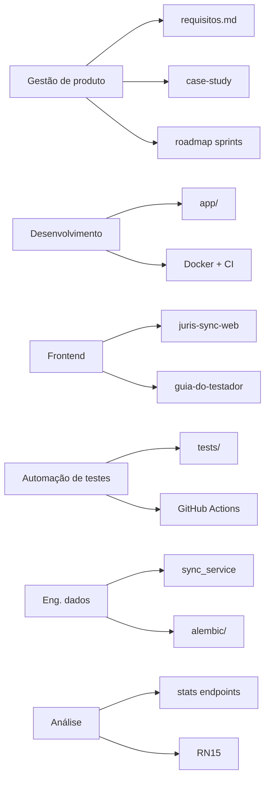
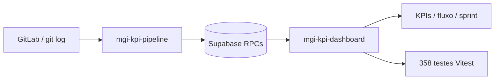

# Competências com evidências

Este documento reúne **evidências verificáveis** dos projetos de portfólio publicados no GitHub. Não agrega automaticamente todo o seu GitHub: cada link aponta para artefato real em repositório específico.

| Ecossistema | Repositórios | Papel no portfólio |
|-------------|--------------|-------------------|
| **JurisSync** | [juris-sync](https://github.com/MariaHilmar/juris-sync), [juris-sync-web](https://github.com/MariaHilmar/juris-sync-web) | API + dashboard de estudo (Python/FastAPI, jurimetria, testes em camadas) |
| **MGI KPI** | [mgi-kpi-dashboard](https://github.com/MariaHilmar/mgi-kpi-dashboard), [mgi-kpi-pipeline](https://github.com/MariaHilmar/mgi-kpi-pipeline) | BI de engenharia (ETL Python + dashboard Next.js/Supabase) |

Os projetos são **artefatos de portfólio** (demo local ou deploy com auth), não serviços oficiais de órgãos públicos nem produtos em produção com dados sensíveis versionados.

**Case study JurisSync:** [`case-study-juris-sync.md`](case-study-juris-sync.md) · **Site:** [mariahilmar.vercel.app](https://mariahilmar.vercel.app) · **Guia do testador JurisSync:** [juris-sync-web](https://github.com/MariaHilmar/juris-sync-web/blob/main/docs/guia-do-testador.md) · **Demo MGI KPI:** [web-mgi-delog.vercel.app](https://web-mgi-delog.vercel.app)

---

## Visão geral

| Área | Nível | Projeto | Evidência principal |
|------|-------|---------|---------------------|
| Gestão de produto / projetos | Avançado | JurisSync | Roadmap em sprints, requisitos rastreáveis, BDD |
| Desenvolvimento backend | Avançado | JurisSync API | FastAPI async, camadas, Docker, CI |
| Frontend (stack de mercado) | Intermediário | JurisSync Web | Next.js, React, TypeScript, TanStack Query |
| Automação de testes | Avançado | JurisSync API (+ Vitest no web) | 43 testes em 5 camadas, Testcontainers, Schemathesis |
| Engenharia de dados | Intermediário-avançado | JurisSync API | Pipeline ETL idempotente, Alembic, integração DataJud |
| Análise de dados | Intermediário | JurisSync API + Web | Stats SQL + dashboard Recharts |
| BI / KPIs de engenharia | Avançado | MGI KPI Dashboard + Pipeline | ETL GitLab → Supabase, RPCs PostgreSQL, 358 testes Vitest |
| Full-stack (dados + UX) | Avançado | MGI KPI Dashboard | Next.js 16 Server Components, cache, GovBR DS, SonarCloud |

*Níveis são autoavaliação com base no escopo dos projetos de portfólio, não em anos de experiência formal.*

---

# Parte A - JurisSync (estudo Python / jurimetria)

## 1. Gestão de produto e projetos

**O que demonstro:** priorização em sprints, requisitos funcionais e não funcionais, critérios de aceite, rastreabilidade e entrega incremental.

| Evidência | Onde ver |
|-----------|----------|
| Roadmap de 5 sprints com status | [`juris-sync/README.md`](../../juris-sync/README.md#roadmap-sprints) |
| Visão do produto, glossário e escopo | [`juris-sync/docs/requisitos.md`](../../juris-sync/docs/requisitos.md#1-visão-do-produto) |
| 16 regras de negócio documentadas (RN01-RN16) | [`juris-sync/docs/requisitos.md`](../../juris-sync/docs/requisitos.md#4-regras-de-negócio) |
| Histórias de usuário e cenários BDD | [`juris-sync/docs/requisitos.md`](../../juris-sync/docs/requisitos.md#5-histórias-de-usuário) |
| Rastreabilidade requisito → código → teste | [`juris-sync/docs/requisitos.md`](../../juris-sync/docs/requisitos.md#9-rastreabilidade-requisito---código---teste) |
| Narrativa de entrega (case study) | [`case-study-juris-sync.md`](case-study-juris-sync.md#6-gestão-da-entrega) |
| Coleção Postman para demo e onboarding | [`juris-sync/postman/`](../../juris-sync/postman/) |

**Exemplo citável:** *"Requisitos escritos em paralelo ao código, com 16 regras de negócio rastreáveis até testes automatizados."*

---

## 2. Desenvolvimento backend

**O que demonstro:** APIs REST assíncronas, arquitetura em camadas, validação na fronteira, containerização e pipeline de CI.

| Evidência | Onde ver |
|-----------|----------|
| Entrypoint FastAPI | [`juris-sync/app/main.py`](../../juris-sync/app/main.py) |
| Rotas e contratos OpenAPI | [`juris-sync/app/api/process.py`](../../juris-sync/app/api/process.py) |
| Schemas Pydantic v2 | [`juris-sync/app/schemas/process.py`](../../juris-sync/app/schemas/process.py) |
| Modelos ORM SQLAlchemy 2.0 async | [`juris-sync/app/models/process.py`](../../juris-sync/app/models/process.py) |
| Config centralizada | [`juris-sync/app/core/config.py`](../../juris-sync/app/core/config.py) |
| Logs estruturados | [`juris-sync/app/core/logging.py`](../../juris-sync/app/core/logging.py) |
| Dockerfile multi-stage | [`juris-sync/Dockerfile`](../../juris-sync/Dockerfile) |
| Docker Compose (PostgreSQL) | [`juris-sync/docker-compose.yml`](../../juris-sync/docker-compose.yml) |
| CI (lint + test + integração) | [`juris-sync/.github/workflows/ci.yml`](../../juris-sync/.github/workflows/ci.yml) |
| Swagger UI (local) | http://localhost:8000/docs |

**Stack:** Python 3.12+, FastAPI, SQLAlchemy 2.0 async, Alembic, Pydantic v2, httpx, structlog, Docker.

**Exemplo citável:** *"API REST async com camadas api/core/models/schemas/services, documentada via OpenAPI e validada com Pydantic na fronteira."*

---

## 3. Automação de testes

**O que demonstro:** pirâmide de testes, mocks de HTTP, reconciliação de dados, integração com banco real e contract testing.

| Camada | O que valida | Arquivo(s) |
|--------|--------------|------------|
| Unitário / schemas | Validação Pydantic, regras isoladas | [`juris-sync/tests/test_schemas.py`](../../juris-sync/tests/test_schemas.py), [`test_sync_service.py`](../../juris-sync/tests/test_sync_service.py), [`test_rag_enricher.py`](../../juris-sync/tests/test_rag_enricher.py) |
| API (ASGI) | Endpoints HTTP reais contra FastAPI | [`juris-sync/tests/test_api.py`](../../juris-sync/tests/test_api.py) |
| Mock HTTP | Contrato da chamada DataJud, fallbacks | [`juris-sync/tests/test_datajud_client.py`](../../juris-sync/tests/test_datajud_client.py), [`test_datajud_client_contract.py`](../../juris-sync/tests/test_datajud_client_contract.py) |
| Reconciliação | Fidelidade dos dados, atomicidade, sem órfãos | [`juris-sync/tests/test_sync_reconciliation.py`](../../juris-sync/tests/test_sync_reconciliation.py) |
| Integração | PostgreSQL real via Testcontainers + Alembic | [`juris-sync/tests/integration/test_sync_service_postgres.py`](../../juris-sync/tests/integration/test_sync_service_postgres.py) |
| Contrato OpenAPI | Fuzzing com Schemathesis | [`juris-sync/tests/contract/test_openapi_contract.py`](../../juris-sync/tests/contract/test_openapi_contract.py) |

| Métrica | Valor | Onde ver |
|---------|-------|----------|
| Total de testes | 43 | [`juris-sync/README.md`](../../juris-sync/README.md#-testes-automatizados) |
| Cobertura (suíte padrão) | ~89,9% | [`juris-sync/pyproject.toml`](../../juris-sync/pyproject.toml) (`--cov-fail-under=85`) |
| CI verde | Badge | https://github.com/MariaHilmar/juris-sync/actions/workflows/ci.yml |

**Ferramentas:** pytest, pytest-asyncio, pytest-cov, httpx, respx, factory-boy, Testcontainers, Schemathesis, Hypothesis, Mypy.

**Exemplo citável:** *"43 testes em 5 camadas, incluindo Postgres real via Testcontainers e fuzzing OpenAPI com Schemathesis."*

---

## 4. Engenharia de dados

**O que demonstro:** pipeline de ingestão, normalização, persistência idempotente, versionamento de schema e integração com fonte externa.

| Evidência | O que prova | Onde ver |
|-----------|-------------|----------|
| Cliente DataJud + mock determinístico | Extração e fallback sem chave API | [`juris-sync/app/services/datajud_client.py`](../../juris-sync/app/services/datajud_client.py) |
| Orquestrador de sync (ETL) | Extração → enriquecimento → validação → upsert | [`juris-sync/app/services/sync_service.py`](../../juris-sync/app/services/sync_service.py) |
| Enriquecimento RAG | Normalização de classe, assunto, tribunal | [`juris-sync/app/services/rag/enricher.py`](../../juris-sync/app/services/rag/enricher.py) |
| Migration inicial | Modelagem relacional versionada | [`juris-sync/alembic/versions/`](../../juris-sync/alembic/versions/) |
| RN03 - idempotência incremental | Movimentações novas apenas | [`juris-sync/docs/requisitos.md`](../../juris-sync/docs/requisitos.md#rn03---movimentações-são-inseridas-apenas-se-novas-idempotência-incremental) |
| RN04 - atomicidade | Rollback em falha parcial | [`juris-sync/docs/requisitos.md`](../../juris-sync/docs/requisitos.md#rn04---pipeline-de-sincronização-é-atômico-tudo-ou-nada) |
| Teste de reconciliação | Fidelidade persistida vs. fonte | [`juris-sync/tests/test_sync_reconciliation.py`](../../juris-sync/tests/test_sync_reconciliation.py) |
| Integração Postgres | Pipeline contra banco real | [`juris-sync/tests/integration/test_sync_service_postgres.py`](../../juris-sync/tests/integration/test_sync_service_postgres.py) |

**Fluxo ETL:**

```
DataJud (ou mock) → RAG (normalização) → Pydantic (validação) → upsert idempotente
```

**Exemplo citável:** *"Pipeline ETL idempotente com reconciliação: re-sync não duplica processos nem movimentações."*

---

## 5. Análise de dados

**O que demonstro:** agregações SQL sobre base persistida, endpoints de jurimetria e regra de negócio para análise local.

| Evidência | O que prova | Onde ver |
|-----------|-------------|----------|
| Stats por tribunal | `GROUP BY` tribunal | [`juris-sync/app/api/process.py`](../../juris-sync/app/api/process.py) (rota `stats/por-tribunal`) |
| Stats por assunto | `GROUP BY` assunto | [`juris-sync/app/api/process.py`](../../juris-sync/app/api/process.py) (rota `stats/por-assunto`) |
| RN15 - jurimetria local | Análise sempre sobre base persistida | [`juris-sync/docs/requisitos.md`](../../juris-sync/docs/requisitos.md#rn15---jurimetria-é-sempre-sobre-a-base-local) |
| Testes dos endpoints de stats | Comportamento validado | [`juris-sync/tests/test_api.py`](../../juris-sync/tests/test_api.py) (`test_api_jurimetria_stats_endpoints`) |
| Case study - seção jurimetria | Contexto de negócio | [`case-study-juris-sync.md`](case-study-juris-sync.md#3-solução) |

**Endpoints:**

| Método | Rota | Descrição |
|--------|------|-----------|
| `GET` | `/api/v1/processos/stats/por-tribunal` | Contagem de processos por tribunal |
| `GET` | `/api/v1/processos/stats/por-assunto` | Contagem de processos por assunto |

**Exemplo citável:** *"Jurimetria via agregações SQL sobre a base local, sem nova consulta ao DataJud a cada análise."*

---

## 6. Frontend (stack de mercado)

**O que demonstro:** cliente web Next.js/React/TypeScript consumindo a API JurisSync, com estados de UX e documentação de teste (mock vs real).

| Evidência | Onde ver |
|-----------|----------|
| Dashboard + lista + detalhe + sync | [juris-sync-web](https://github.com/MariaHilmar/juris-sync-web) |
| Camada HTTP tipada | `juris-sync-web/src/lib/api/` |
| TanStack Query + invalidação após sync | `juris-sync-web/src/hooks/` |
| Guia do testador (clone local) | [guia-do-testador.md](https://github.com/MariaHilmar/juris-sync-web/blob/main/docs/guia-do-testador.md) |
| Testes Vitest + CI | `juris-sync-web/.github/workflows/ci.yml` |

**Exemplo citável:** *"Dashboard Next.js separado da API Python, consumindo o mesmo contrato OpenAPI, com demo local em modo mock ou DataJud real."*

---

# Parte B - MGI KPI (BI de engenharia - projeto separado)

> **Aviso:** projeto de portfólio inspirado em necessidades reais de monitoramento de equipes. **Não é sistema oficial do MGI.** Sem dados sensíveis ou credenciais no repositório.

## 7. MGI KPI Dashboard + Pipeline

**O que demonstro:** arquitetura full-stack para KPIs de engenharia - pipeline ETL Python (GitLab → regras em memória → Supabase) e dashboard Next.js somente leitura com agregações via RPC PostgreSQL.

| Evidência | O que prova | Onde ver |
|-----------|-------------|----------|
| Dashboard web (este repo) | Visualização, auth, filtros globais, drill-down | [mgi-kpi-dashboard](https://github.com/MariaHilmar/mgi-kpi-dashboard) |
| Pipeline ETL (repo irmão) | Extração GitLab/Git, transformação, upsert idempotente | [mgi-kpi-pipeline](https://github.com/MariaHilmar/mgi-kpi-pipeline) |
| Server Components + cache | Performance e streaming com `unstable_cache` (TTL 24h) | `mgi-kpi-dashboard/lib/dashboard/` |
| Regras no banco (RPCs) | Agregações pesadas no PostgreSQL, frontend read-only | `mgi-kpi-dashboard/supabase/migrations/` |
| KPIs e fluxo | CFD, throughput, lead time, alertas, sprint, parcerias | Rotas `/`, `/fluxo`, `/sprint`, `/alertas` (ver README do dashboard) |
| Testes frontend | 358 testes Vitest + Testing Library | `mgi-kpi-dashboard/tests/` |
| CI + qualidade | Lint, tipos, testes, SonarCloud | [`.github/workflows/ci.yml`](https://github.com/MariaHilmar/mgi-kpi-dashboard/actions/workflows/ci.yml) |
| Lógica ETL testável | Funções puras (`issue_fields.py`), pytest + Ruff | `mgi-kpi-pipeline/tests/` |
| Demo deployada | Vercel com autenticação Supabase | [web-mgi-delog.vercel.app](https://web-mgi-delog.vercel.app) |

**Stack:** Next.js 16, React 19, TypeScript, Tailwind 4, GovBR Design System, Recharts, Supabase (PostgreSQL + Auth), Python 3.11+, GitHub Actions, SonarCloud.

**Fluxo:**

```
GitLab / git log → mgi-kpi-pipeline (ETL Python) → Supabase (RPCs + views) → mgi-kpi-dashboard (Next.js)
```

**Exemplo citável:** *"BI de engenharia com ETL Python idempotente e dashboard Next.js read-only: agregações em RPC PostgreSQL, 358 testes Vitest e CI com SonarCloud."*

---

## Mapa rápido: competência → artefato

### JurisSync



### MGI KPI



---

## Outros repositórios (fora deste documento)

| Repositório | Visibilidade | Incluir em competencias.md? |
|-------------|--------------|----------------------------|
| [mgi-kpi-pipeline](https://github.com/MariaHilmar/mgi-kpi-pipeline) | Público | Sim - citado na Parte B (par do dashboard) |
| Situação Jurídica (produto) | Privado | Narrativa pública em [`case-study-situacao-juridica.md`](case-study-situacao-juridica.md) - sem links de código |
| `contratos-v2-analise` | Público | Opcional - incluir só se README e escopo estiverem prontos para avaliação |
| Demais privados | Privado | Evitar links - recrutador não consegue verificar |

---

## Próximas evidências (opcional)

| Item | Status |
|------|--------|
| Site live | https://mariahilmar.vercel.app |
| Dashboard Next.js (JurisSync) | Repo [juris-sync-web](https://github.com/MariaHilmar/juris-sync-web) - demo local |
| Demo MGI KPI | [web-mgi-delog.vercel.app](https://web-mgi-delog.vercel.app) (auth Supabase) |
| Screenshots locais (Swagger, CI) | Instruções em [`docs/assets/README.md`](assets/README.md) |
| Domínio customizado | Opcional |
| API demo pública | Não implantada (avaliação esperada: local) |

---

*Documento do hub de portfólio. Última atualização: 2026-07-20 (inclui MGI KPI Dashboard como projeto separado).*
